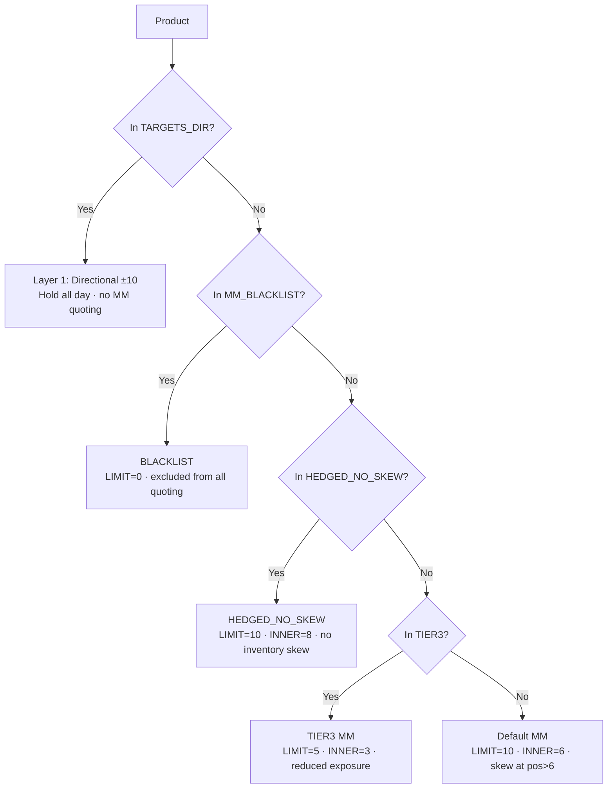

# Round 5 Parameters (v42 — final submission)

> Every constant in `round5/strategies/round5_v42_trader.py`, with the evidence that locked it.

## Layer 1 — Directional Hold

```python
LIMIT = 10                         # all 50 R5 products (universal)
TARGETS_DIR = {                    # 13 products at fixed ±LIMIT, hold all day
    "MICROCHIP_OVAL":             -10,
    "PEBBLES_XL":                 +10,
    "OXYGEN_SHAKE_GARLIC":        +10,
    "GALAXY_SOUNDS_BLACK_HOLES":  +10,
    "PEBBLES_S":                  -10,
    "PEBBLES_XS":                 -10,
    "PANEL_2X4":                  +10,
    "UV_VISOR_AMBER":             -10,
    "UV_VISOR_RED":               +10,
    "SNACKPACK_PISTACHIO":        -10,
    "PEBBLES_M":                  -10,    # PEBBLES basket completion
    "PEBBLES_L":                  -10,    # PEBBLES basket completion
    "SNACKPACK_STRAWBERRY":       +10,    # v41/v42 addition
}
```

**Selection criterion**: sign-stable drift across days 2/3/4 in `full_day_optimal.csv` (HIGH-confidence) OR full-day drift sign-consistent + reliable Prosperity log evidence.

| Product | Sign basis | Day-2/3/4 drift |
|---|---|---|
| MICROCHIP_OVAL | HIGH | −744 / −1,824 / −1,898 |
| PEBBLES_XL | MED (day-3 dip) | +3,675 / −1,553 / +4,014 |
| OXYGEN_SHAKE_GARLIC | HIGH | +1,829 / +111 / +1,959 |
| GALAXY_SOUNDS_BLACK_HOLES | HIGH | +1,447 / +689 / +1,321 |
| PEBBLES_S | HIGH | −840 / −177 / −937 |
| PEBBLES_XS | HIGH | −1,952 / −1,204 / −824 |
| PANEL_2X4 | HIGH | +738 / +738 / +895 |
| UV_VISOR_AMBER | HIGH | small but consistent − |
| UV_VISOR_RED | HIGH | consistent + |
| SNACKPACK_PISTACHIO | HIGH | −489 / −124 / −282 |
| PEBBLES_M, PEBBLES_L | basket | added v34 (anti-correlated with XL) |
| SNACKPACK_STRAWBERRY | HIGH | +436 / +358 / +98 |

## Layer 2 — Per-Product Market Making

```python
MM_LIMIT_DEFAULT       = 10
MM_INNER_SIZE          = 6      # quote at touch (best_bid / best_ask)
MM_OUTER_SIZE          = 4      # quote 1 tick outside (best_bid-1 / best_ask+1)
MIN_SPREAD             = 2      # minimum spread to trigger MM
SKEW_THRESHOLD_DEFAULT = 6      # at |pos| > 6, skew quotes asymmetrically

# TIER3 — reduced exposure for adverse-selection-prone products
MM_LIMIT_TIER3         = 5
TIER3_INNER_SIZE       = 3
TIER3_OUTER_SIZE       = 2
SKEW_THRESHOLD_TIER3   = 3

# HEDGED_NO_SKEW — bigger inner for SNACKPACK CHOC/VAN structural pair
HEDGED_INNER_SIZE      = 8
HEDGED_OUTER_SIZE      = 2
```

### Set assignments (v42 final)

```python
MM_BLACKLIST = {                    # 11 products excluded entirely
    # 3 zero-fill from v34 (earn $0 anyway, safe to skip)
    "TRANSLATOR_SPACE_GRAY",
    "GALAXY_SOUNDS_PLANETARY_RINGS",
    "ROBOT_DISHES",
    # 7 ex-TIER3 confirmed losers (LIMIT=5 wasn't enough)
    "OXYGEN_SHAKE_MORNING_BREATH",
    "GALAXY_SOUNDS_DARK_MATTER",
    "PANEL_2X2",
    "ROBOT_LAUNDRY",
    "PANEL_1X2",
    "PANEL_1X4",
    "OXYGEN_SHAKE_MINT",
    # ex-default-MM consistent loser
    "SLEEP_POD_LAMB_WOOL",
}

TIER3_PRODUCTS = {                  # 2 small-loss products kept at LIMIT=5
    "MICROCHIP_RECTANGLE",          # v34 −$128
    "OXYGEN_SHAKE_EVENING_BREATH",  # v34 −$30
}

HEDGED_NO_SKEW = {                  # structural pair, ρ = −0.916
    "SNACKPACK_CHOCOLATE",
    "SNACKPACK_VANILLA",
}
```

### Effective coverage

```text
Total products:                                              50
  Layer 1 directional (excluded from Layer 2 MM):           −13
  Layer 2 default MM (LIMIT 10):                             24
  Layer 2 HEDGED_NO_SKEW (LIMIT 10, INNER 8):                 2
  Layer 2 TIER3 (LIMIT 5, INNER 3):                          2
  Layer 2 BLACKLIST (LIMIT 0):                               11
  ────────────────────────────────────────────────────────────
  Sum check: 13 + 24 + 2 + 2 + 11 =                          52
```

(52 ≠ 50 because the 3 zero-fill blacklist entries are technically already not traded — they're explicitly excluded for clarity. Effective traded: 50 − 11 BLACKLIST = 39 products.)

## Calibration Sources

| Parameter | Source |
|---|---|
| All 13 directional product/sign pairs | `round5/plots/full_day_optimal.csv` (HIGH-confidence rows) + Prosperity-log validation |
| MM_BLACKLIST 8 newly-added losers | `round5/research/analyze_prosperity_logs.py` aggregating N=12 versions; threshold `avg ≤ −$500 AND 0/12 positive` |
| TIER3 2 keepers | v34 backtester losses < $200/run (small enough for upside potential) |
| HEDGED_NO_SKEW pair | `round5/plots/within_category_xcorr_summary.csv` row 2: ρ = **−0.915909** for SNACKPACK_CHOCOLATE/SNACKPACK_VANILLA |
| MM_LIMIT_DEFAULT = 10 | v34 baseline (top earners need full LIMIT) |
| MM_INNER_SIZE = 6, OUTER = 4 | v9 calibration on Prosperity log evidence |
| SKEW_THRESHOLD = 6 | v9 setting (later skew = more inventory tolerance for top earners) |
| MM_LIMIT_TIER3 = 5 | v26 calibration (half default; smaller loss footprint at adverse selection) |
| MIN_SPREAD = 2 | v9 setting (skip 1-tick markets where MM has no edge) |

## Notable Choices Compared to R3

| Parameter | R3 (HYDROGEL) | R5 (default MM) | Why different |
|---|---|---|---|
| Position limit | 200 | 10 | R5 hard rule |
| MIN_SPREAD trigger | 16 ticks | 2 ticks | R5 has tight spreads |
| Inner quote size | 32 | 6 | R5 LIMIT cap |
| Outer quote size | — (1-level) | 4 | R5 has 2-level depth |
| Inventory skew coef | 0.03 (continuous) | step at \|pos\| > 6 | R5's tighter LIMIT makes step-skew sufficient |
| Anchor pull | 0.20·10000 | none | R5 mids drift; no fixed anchor |
| OBI signal | disabled (β=0) | disabled (Phase 14 found 8 OOS-significant but didn't ship) | both rounds: signal too weak vs cost |

## Product Routing Decision Flow



## Links

[[Strategies/Round5_Version_History]] · [[Strategies/Directional_Holding]] · [[Strategies/TIER3_Market_Making]] · [[Strategies/HEDGED_NO_SKEW]] · [[Strategies/Cross_Version_Blacklist]] · [[Concepts/Backtester_vs_Competition]] · [[Concepts/Adverse_Selection]] · [[Research/Decisions_Log]] · [[Backtests/PnL_Timeline]]
