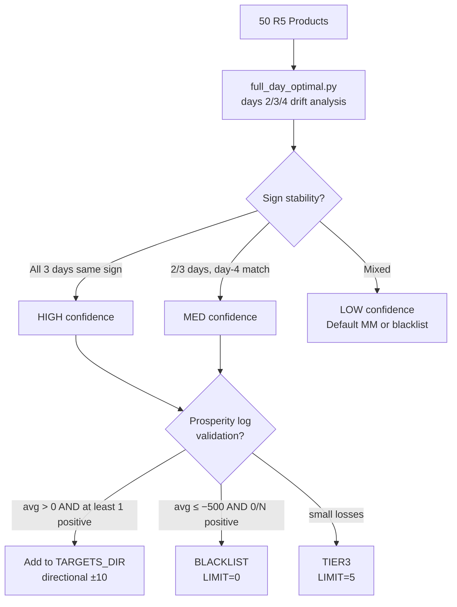

# Directional Holding Strategy (Round 5)

## What It Is

For a chosen product with a known multi-day **drift sign**, build the **maximum allowed position** (±LIMIT) by aggressively crossing the spread on the first available tick, then **hold for the rest of the day**. No active management, no rebalancing, no MM logic. The PnL accrues from the price drift × position size, minus the one-time half-spread paid on entry.

This is the **opposite philosophy** to the R3 HYDROGEL strategy: HYDROGEL exploits **lag-1 mean reversion** with passive quoting; directional holding exploits **multi-day drift** with aggressive entry.

**ML analogy:** Directional holding is a **static prediction** — pick the sign of `mid[T] − mid[0]`, commit, never rebalance. The hyper-low-frequency analogue of `argmax_y P(y | day_features)`. By contrast, MM is a **streaming policy** with continuous re-estimation. R5 forced this static-prediction shape because per-tick alpha was too low (AR(1) ≈ 0.999) to justify continuous decision-making.

## Why Directional, Not MM?

- **AR(1) ≈ 0.999** across all 50 R5 products — effectively a random walk with drift. No tick-level mean-reversion to harvest.
- **Position limit ±10** caps inventory tightly. A drift of $X over a day yields `±10 × X` directly; an MM strategy at ±10 caps inventory at the same level but pays spread on every cycle and faces adverse selection.
- **Entry cost is one-time** (half-spread, ~5 ticks/$). Holding is free. Drift over a day is $100–$4,000 per product → entry cost is rounding error.

## Mechanics

```python
LIMIT = 10
TARGETS = {"MICROCHIP_OVAL": -10, "PEBBLES_XL": +10, ...}

for product, target in TARGETS.items():
    od = state.order_depths.get(product)
    if od is None: continue
    best_bid, best_ask = max(od.buy_orders), min(od.sell_orders)
    pos = state.position.get(product, 0)
    delta = target - pos
    if delta == 0: continue   # already at target — hold
    if delta > 0:              # need to buy: take the ask
        qty = min(delta, LIMIT - pos)
        orders.append(Order(product, best_ask, qty))
    else:                       # need to sell: hit the bid
        qty = max(delta, -LIMIT - pos)
        orders.append(Order(product, best_bid, qty))
```

Stateless: `traderData = ""`. Position is recovered from `state.position` each tick — no need for jsonpickle, no day-boundary reset logic. The hold is enforced by `delta == 0 → no order`.

## Product Selection (the hard part)

The mechanics are trivial; the alpha is in **picking the right products and signs**. Three rounds of selection produced v42's 13 directional bets.

### Phase 13 (Round 1 of selection): OOS-validated train+OOS

`round5/research/eda.py` ran per-product day-2/day-3 fits with day-4 OOS. Selection criterion: same drift sign on all 3 days, OOS day-4 PnL > 0 at ±LIMIT.

7 products survived: MICROCHIP_OVAL (−), PEBBLES_XL/S/XS, OXYGEN_SHAKE_GARLIC, GALAXY_SOUNDS_BLACK_HOLES, PANEL_2X4. Phase 13 baseline: **$261,461 GRAND TOTAL over 3 days, $118,083 OOS day 4.** See [[Backtests/Phase13_R5_Directional]].

### Phase 17 (v23 era): real-Prosperity-validated additions

After v9 ran on real Prosperity, log evidence revealed three more reliable directional bets:

| Product | Direction | v9 Prosperity day-4 PnL |
|---|---|---|
| UV_VISOR_AMBER | −10 | +$4,164 |
| UV_VISOR_RED | +10 | +$5,856 |
| SNACKPACK_PISTACHIO | −10 | +$273 (small but consistent direction) |

Three other v9 directional bets were dropped: SLEEP_POD_LAMB_WOOL (−$5,978), SNACKPACK_STRAWBERRY (−$199 — re-added in v41), SNACKPACK_CHOCOLATE (−$842 — instead routed to HEDGED_NO_SKEW).

### v34 era: structural basket completion

Pairs analysis (`round5/research/pairs_analysis.py`) showed PEBBLES sub-variants are anti-correlated with PEBBLES_XL (ρ ≈ −0.5). Adding PEBBLES_M and PEBBLES_L at −10 captures the basket directional alpha:

| Product | Direction | v34 Prosperity day-4 |
|---|---|---|
| PEBBLES_M | −10 | +$1,487 |
| PEBBLES_L | −10 | +$512 |

### v41/v42 final addition

| Product | Direction | Reason |
|---|---|---|
| SNACKPACK_STRAWBERRY | +10 | 3-day sign-stable drift +436/+358/+98; backtester loss only −$199; favorable risk/reward |

## Confidence Tiers (from `full_day_optimal.csv`)

The `full_day_optimal.py` script classifies each of the 50 products by full-day drift consistency on days 2/3/4:

| Confidence | Criterion | Action |
|---|---|---|
| **HIGH** | Sign-stable on all 3 days | Trade directional ±10 |
| MED | Sign agrees on 2/3 days, day-4 sign matches | Optional directional based on risk |
| LOW | Mixed across days | Default MM (do NOT trade directional) |

v42 uses HIGH-confidence bets only, plus 2 strong MED-confidence hold-overs (UV_VISOR_AMBER which has near-HIGH consistency, and PEBBLES_XL which is HIGH on full-day even with the day-3 dip).

## Edge Cases & Failures

### MICROCHIP_SQUARE — Phase 13's killed candidate

Train days 2+3 showed +$2,456 / +$3,438. Day-4 OOS reversed to **−$2,278**. Killed by the OOS gate. The single most important null in the EDA — taught the team why "average across days" can lie when one day dominates.

### v37's BLACK_HOLES flip — the wrong window mistake

v37 flipped GALAXY_SOUNDS_BLACK_HOLES from +10 to −10 because the **Prosperity-window drift** was negative all 3 days (−85, −53, −65). The full-day drift was strongly positive (+1,446, +688, +1,320). v37 was catastrophic on the competition's full-day scoring (−$26K vs v34). See [[Concepts/Backtester_vs_Competition]].

### v39's PEBBLES_XL drop

v39 dropped PEBBLES_XL because day-3 had a −$15,615 reversal. But days 2 and 4 had +$36,685 and +$40,060. **Net 3-day +$61,130, OOS day-4 +$40,060.** Dropping it lost ~$40K of single-day alpha for ~$15K of variance reduction. Don't drop a HIGH-confidence directional after one bad day.

## Why This Works When MM Fails

For a product where MM loses to adverse selection (informed counterparties picking off your quotes), **directional holding is immune** — you don't quote both sides, you don't adjust, you just commit. The price decides whether you win. The trade-off: you can't capture spread on top of drift; you eat the spread once on entry.

For a product where drift is small (< $200/day) but mean-reversion is real, **MM wins** — drift × 10 = $2K not enough to amortize the risk of a wrong sign-bet, while spread capture × N trades adds up.

This is why R5 has both layers: directional for HIGH-confidence-drift products, MM for the rest, blacklist for products that lose to both.

## Product Selection Flow



## Post-Result Validation (2026-05-08)

The DIRECTIONAL bucket realized **+$67,111** on Day 5 — the dominant alpha source for the round (carried 116% of the +$57,911 net). 13 products at ±10:

| Outcome | n | Net | Notes |
|---|---|---|---|
| Worked as designed | 7 | +$107,914 | PEBBLES_M, PEBBLES_XL, OS_GARLIC, UV_VISOR_RED, PEBBLES_L, UV_VISOR_AMBER, SNACKPACK_STRAWBERRY |
| Reversed against design | 6 | −$40,803 | PEBBLES_S −$24,852 (load-bearing miss), PANEL_2X4 −$3,822, BLACK_HOLES −$4,914, PEBBLES_XS, MICROCHIP_OVAL, SNACKPACK_PISTACHIO |

**The architecture worked.** 7 of 13 directional bets paid; the basket-level positive sum confirms that fixed-±10 directional holds extract real per-day drift alpha against the field. The miss rate (6/13 = 46%) is higher than the training-window forecast suggested but the wins-vs-losses asymmetry kept the bucket strongly net-positive.

**The PEBBLES basket (5 products) realized +$38,974** as a sub-basket: 3 of 5 worked, 2 reversed (PEBBLES_S −$24,852 was the worst single trade). The structural anti-correlation thesis (ρ ≈ −0.5) held overall — when one PEBBLES variant moved, the basket's diversification across the 5 sub-variants captured the move.

## Links

[[Rounds/Round5_findings]] · [[Backtests/Phase13_R5_Directional]] · [[Strategies/TIER3_Market_Making]] · [[Strategies/HEDGED_NO_SKEW]] · [[Strategies/Round5_Version_History]] · [[Concepts/Backtester_vs_Competition]] · [[Concepts/Adverse_Selection]] · [[Products/Round5_Categories]] · [[Performance/Algo_Per_Round]]
